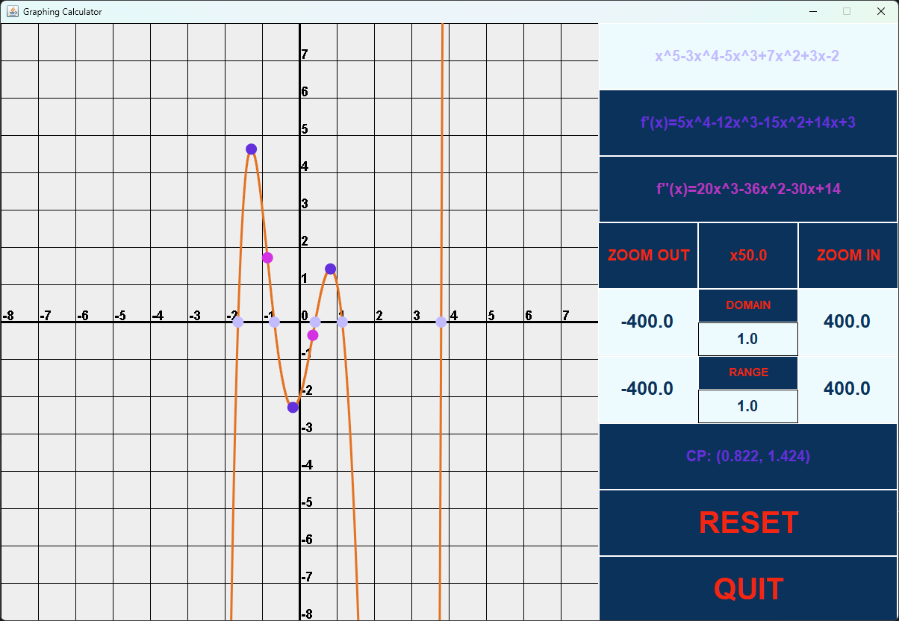
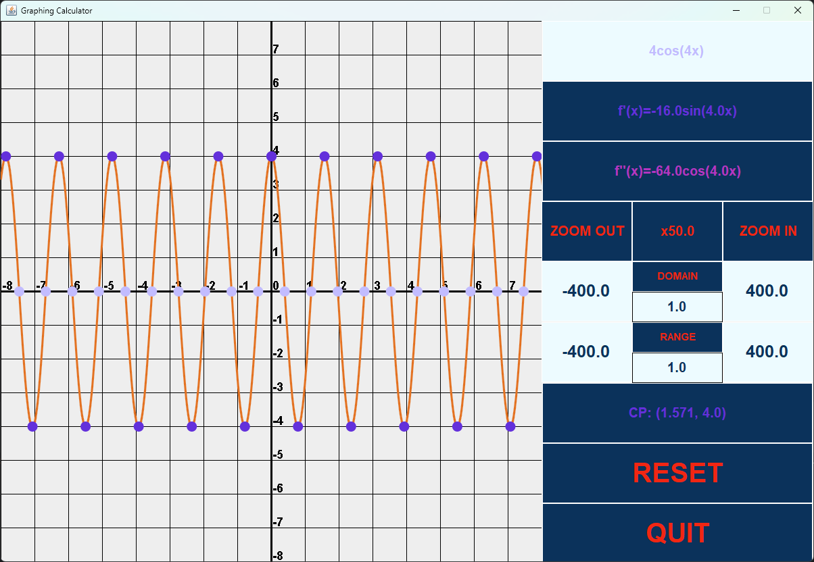
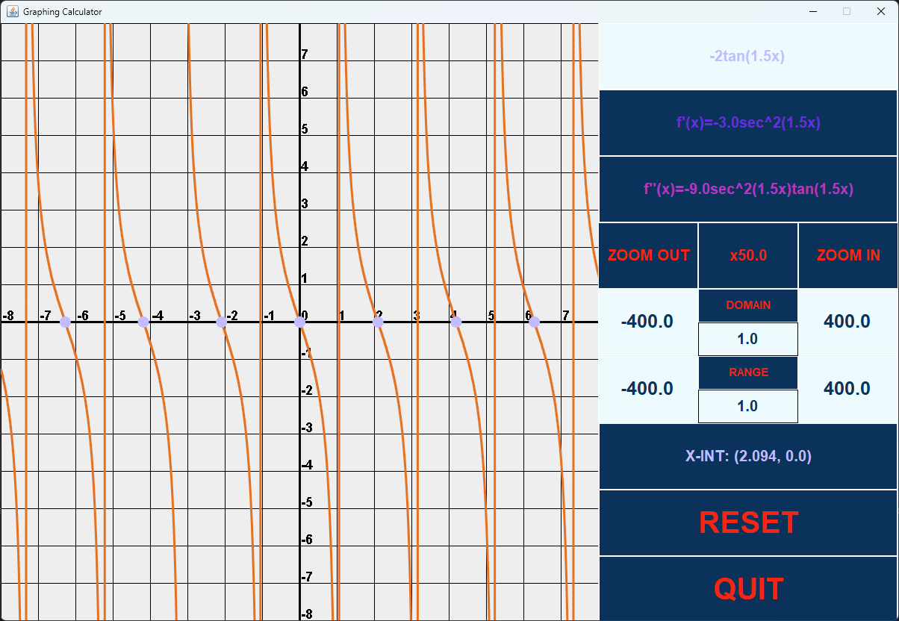

# Lab 09 - Advanced 2D Graphics

CSCI 2020U: Software Systems Development and Integration

## Overview

In this lab, you will make a mock version of [Desmos](https://www.desmos.com/calculator), a graphing calculator. You will implement only a subset of Desmos' features. It will support polynomials, $ln$ / $log$, and trigonometric functions and calculate roots, critical points, and inflection points.

## Tasks
- Read the optional tasks first to avoid confusion about what is mandatory and optional.

- You can use [Desmos](https://www.desmos.com/calculator) to verify your solution.

- First, draw the `CartesianPlane` (`components/CartesianPlane.java`). Using 2D graphics, draw the grid and the axis tick labels.

- You will implement two trigonometric functions, `components/function/Cosine.java` and `components/function/Tangent.java`:
  - `getFirstDerivative()`: Calculate the first derivative associated with the function.
  - `getSecondDerivative()`: Calculate the second derivative associated with the function.
  - `getValueAt()`: Given `x` and `FunctionType`, return the `y` value at `x`.
       
    `Sine` has already been implemented for you. Use this as an example for the other two trigonometric functions.

- Next, graph the function in `components/functions/Function.java,` here are the recommended steps:
  - Increment $x$ at a small step, $s$ (e.g. 0.02)
  - Call `getValueAt()` to get $f(x)$. Use `FunctionType.ORIGINAL` as the function type to call `getValueAt()`.
  - Draw a line from $(x, f(x))$ to $(x + s, f(x + s))$
  >Note the inverted y-axis

- Finally, you will implement [Newton's method](https://en.wikipedia.org/wiki/Newton%27s_method) to find roots in `enums/RootType.java`. Wikipedia also provides the pseudocode.

>Check the TODO comments for extra hints.

  
  
  

>The auto grader will not check for correctness, this will be manually done.

## Optional
- The grid and function do not need to respond to zooming for this lab. As an extra challenge, you can complete this task.
- The GUI have the option to cut the domain and range (Default: -400, +400), where the function only gets drawn if it is within the domain and range. This is also optional.
- As a final extra challenge, you can change the scale of the domain and range (Default: 1). For example, the domain can scale by 2 $(2, 4, 6....)$ and the range can scale by 0.5 $(0.5, 1, 1.5...)$. Different scaling would transform the function.

## How to Submit

### In session

(Preferably)

- Show your local and remote repositories to the TA to prove that you have finished this lab.

### After lab hours

(1 week to submit - before your next lab session)

- Link to your GitHub repository on Canvas
- Screenshots of the command line terminal
- Screenshots of the UI
- Add screenshots to `README.md`

The TA can provide oral feedback if you do not receive full marks for any lab assignment, but it is most
appropriate to ask the TA for this feedback in a timely fashion (i.e. ask now, not at the end of the term).
